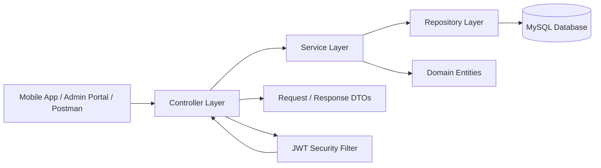

# Valor Lift Services & Maintenance Backend

## Overview
This Spring Boot 3 backend provides the REST API and persistence layer for the Valor Lift Services & Maintenance platform.
It covers:
- JWT-based authentication and authorization
- Customer, technician, and admin workflows
- Lift registration and lifecycle management
- AMC lifecycle management
- Service request handling and tracking
- Swagger/OpenAPI documentation
- MySQL persistence with JPA

## Architecture
The backend follows a layered Spring Boot architecture:



### Layer responsibilities
- Controller layer handles HTTP endpoints and request validation.
- Service layer contains business logic and orchestration.
- Repository layer provides database access through Spring Data JPA.
- Entity classes map the business model to relational tables.
- DTOs keep API payloads separate from persistence models.
- Security components handle JWT authentication and protected routes.
- OpenAPI config exposes interactive API docs through Swagger UI.

## Requirements
- Java 21
- Maven 3.9+
- MySQL 8+

## Run locally
1. Create a MySQL database named `valor_lift_db`
2. Set the values from `.env.example` in your local environment. The database
   password must remain outside Git and should be entered in the Render secret
   environment variables `DB_URL`, `DB_USERNAME`, and `DB_PASSWORD` for
   deployment. `DB_URL` must use your hosted MySQL hostname, for example
   `jdbc:mysql://<mysql-host>:3306/valor_lift_db`.
3. Run:
   ```bash
   mvn spring-boot:run
   ```
4. Open Swagger UI at:
   ```text
   http://localhost:8080/swagger-ui.html
   ```

## Application Flow
### Typical request flow
1. The client sends an HTTP request to a controller endpoint.
2. The controller validates the request and maps it to a DTO or entity.
3. The service layer executes the business rule for that operation.
4. The repository layer reads from or writes to MySQL.
5. The service returns the result to the controller.
6. The controller wraps the result in a response object and sends it back to the client.

### Authentication flow
1. A user signs in with email and password.
2. The authentication service verifies credentials.
3. On success, the backend returns a JWT access token.
4. The client sends the token in the `Authorization` header for protected requests.
5. The JWT filter validates the token before the request reaches secured endpoints.

### AMC and service flow
1. An admin or operator creates or updates AMC records.
2. The AMC service updates contract details, renewal dates, and status.
3. Service requests are created for lift issues, inspections, or maintenance.
4. Technicians and admins update request status as work progresses.
5. The backend stores the latest state in MySQL and exposes it through the API.

## Main API groups
- Authentication: `/api/auth/**`
- Customers: `/api/customers/**`
- Lifts: `/api/lifts/**`
- AMC: `/api/amcs/**`
- Service requests: `/api/service-requests/**`
- Admin: `/api/admin/**`
- Technicians: `/api/technicians/**`

## Code Structure
- `controller/` - HTTP API entry points
- `service/` - Business logic interfaces and implementations
- `repository/` - Spring Data JPA repositories
- `entity/` - Persistent domain models
- `dto/` - API request and response models
- `request/` - Request payload classes
- `response/` - Standard API response wrappers
- `security/` - JWT and security configuration
- `config/` - Application and OpenAPI configuration
- `exception/` - Custom exceptions and handlers

## Client integration contract

Use `http://localhost:8080` as the local API base URL. Production clients should
receive the deployed HTTPS URL through their environment configuration.

### Authentication

- Customer: `POST /api/auth/register`, `POST /api/auth/login`,
  `POST /api/auth/send-otp`, `POST /api/auth/verify-otp`
- Admin: `POST /api/auth/admin/login`
- Technician: `POST /api/auth/technician/login`

Successful login returns an access token and role. Send the token on every
protected request:

```http
Authorization: Bearer <access-token>
```

All JSON responses use the common wrapper `{ success, message, data, timestamp,
status }`. The role values are `CUSTOMER`, `ADMIN`, `SUPER_ADMIN`, and
`TECHNICIAN`.

### Client responsibilities

- Admin web: dashboards, customers, technicians, buildings, lifts, AMCs,
  service assignment, payments, inventory, notifications, and reports.
- Customer app: account/profile, buildings and lifts, service-request creation
  and tracking, AMC/payment details, and notifications.
- Technician app: assigned jobs, customer/lift details, job start, job progress,
  completion, and notifications.

Swagger documentation is available at `/swagger-ui.html` after startup. Do not
point clients at the copied `Backend` folders inside another application; run and
deploy this project as the shared service.
