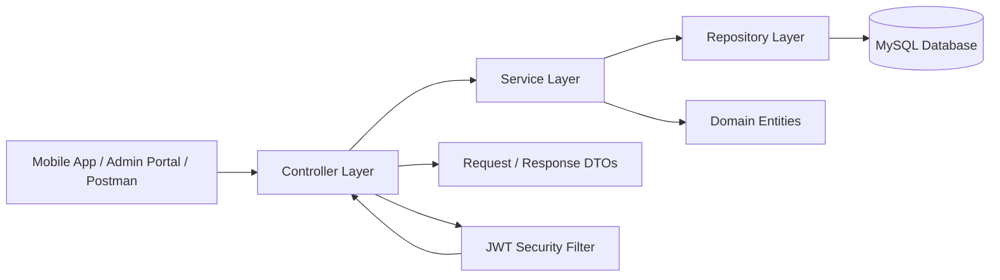

# Valor Lift Services & Maintenance Backend

## Overview
This Spring Boot 3 backend provides the REST API and persistence layer for the Valor Lift Services & Maintenance platform.
It covers:
- JWT-based authentication and authorization
- Customer, technician, and admin workflows
- Lift registration and lifecycle management
- AMC lifecycle management
- Service request handling and tracking
- Payments, invoices, support tickets, PDF service reports, and asset documents
- Swagger/OpenAPI documentation
- MySQL persistence with JPA

## Architecture
The backend follows a layered Spring Boot architecture:



### Layer responsibilities
- Controller layer handles HTTP endpoints and request validation.
- Service layer contains business logic and orchestration.
- Repository layer provides database access through Spring Data JPA.
- Entity classes map the business model to relational tables.
- DTOs keep API payloads separate from persistence models.
- Security components handle JWT authentication and protected routes.
- OpenAPI config exposes interactive API docs through Swagger UI.

## Requirements
- Java 21
- Maven 3.9+
- MySQL 8+

## Run locally
1. Ensure MySQL 8+ is running locally.
2. Copy `.env.example` to `.env` and fill only your local secret values:
   ```powershell
   Copy-Item .env.example .env
   ```
3. The default local database is `valor_world_dev`; the example URL includes
   `createDatabaseIfNotExist=true` so MySQL can create it when the configured
   user has permission.
4. Start the backend:
   ```powershell
   cd D:\RKKKK\Valor-Backend
   mvn spring-boot:run
   ```
5. Open Swagger UI:
   ```text
   http://localhost:8081/swagger-ui.html
   ```

Spring Boot imports the local `.env` file through `spring.config.import`. Keep
`.env` local and never commit it. The dev profile can bootstrap a local
SUPER_ADMIN account when `DEV_BOOTSTRAP_ENABLED=true` and both bootstrap
credentials are present in `.env`.

### Local dev seed data

The `dev` profile can also seed sample records for local UI development:

```dotenv
DEV_SEED_SAMPLE_DATA_ENABLED=true
DEV_SEED_SAMPLE_PASSWORD=<local sample password>
```

When enabled, startup keeps the bootstrap admin account and adds five sample
customers, five sample technicians, buildings, lifts, AMCs, and service
requests if they do not already exist. This is local-only development data; do
not use it for production or shared environments.

Useful local sign-ins after seeding:

- Admin: `admin@valor.local` with `DEV_BOOTSTRAP_SUPER_ADMIN_PASSWORD`.
- Sample customers: `ananya.rao@example.com`, `vikram.menon@example.com`,
  `priya.shah@example.com`, `farhan.khan@example.com`,
  `neha.iyer@example.com` with `DEV_SEED_SAMPLE_PASSWORD`.
- Sample technicians: `tech.arjun@valor.local`, `tech.meera@valor.local`,
  `tech.kabir@valor.local`, `tech.nisha@valor.local`,
  `tech.rohan@valor.local` with `DEV_SEED_SAMPLE_PASSWORD`.

To wipe local data and reseed from scratch, stop the backend and drop only the
local development database configured by `DB_URL`, then run `mvn spring-boot:run`.
Flyway will recreate the schema before the dev seed runs.

### Disposable verification records

Cross-repository local verification may create disposable users and related
records with emails such as `verify.customer.*@valor.local` and
`verify.tech.*@valor.local`. Do not delete production-like or sample seed data
by broad table cleanup. If the local dev database must be pristine, prefer
dropping only the local development database configured by `DB_URL` and letting
Flyway/dev seed recreate it.

## Application Flow
### Typical request flow
1. The client sends an HTTP request to a controller endpoint.
2. The controller validates the request and maps it to a DTO or entity.
3. The service layer executes the business rule for that operation.
4. The repository layer reads from or writes to MySQL.
5. The service returns the result to the controller.
6. The controller wraps the result in a response object and sends it back to the client.

### Authentication flow
1. A user signs in with email and password.
2. The authentication service verifies credentials.
3. On success, the backend returns a JWT access token.
4. The client sends the token in the `Authorization` header for protected requests.
5. The JWT filter validates the token before the request reaches secured endpoints.

### AMC and service flow
1. An admin or operator creates or updates AMC records.
2. The AMC service updates contract details, renewal dates, and status.
3. Service requests are created for lift issues, inspections, or maintenance.
4. Technicians and admins update request status as work progresses.
5. The backend stores the latest state in MySQL and exposes it through the API.

## Main API groups

The canonical API contract lives in `BACKEND_API_CONTRACT.md`. All active
client-facing endpoints use the `/api/v1` prefix and the standard
`{ success, message, data, status, timestamp }` response envelope.

- Authentication: `/api/v1/auth/**`
- Current user: `/api/v1/me`
- Customer profile/assets: `/api/v1/customers/me/**`
- Service requests: `/api/v1/service-requests/**`
- Service visits: `/api/v1/admin/service-visits/**`, `/api/v1/customers/me/visits`, `/api/v1/technician/me/visits`
- Notifications: `/api/v1/notifications`
- Admin operations: `/api/v1/admin/**`
- Technician app: `/api/v1/technician/me/**`
- Payments and invoices: `/api/v1/payments`, `/api/v1/invoices`
- Razorpay checkout/webhook/refunds: `/api/v1/payments/razorpay/checkout`,
  `/api/v1/webhooks/razorpay`, `/api/v1/payments/{id}/refunds`
- Live technician tracking: `/api/v1/technician/me/jobs/{id}/location`,
  `/api/v1/customers/me/service-requests/{id}/technician-location`
- Support tickets: `/api/v1/support-tickets`
- AMC renewal requests: `/api/v1/amc-renewal-requests`
- Building/Lift documents: `/api/v1/buildings/{id}/documents`, `/api/v1/lifts/{id}/documents`,
  `/api/v1/customers/me/buildings/{id}/documents`, `/api/v1/customers/me/lifts/{id}/documents`

### Local file storage

Service-request attachments are stored locally by default under
`./data/request-attachments`. Building/Lift documents are stored locally by
default under `./data/asset-documents`. These directories are local runtime
storage, not source-controlled assets. The API returns safe metadata and file
downloads; it never returns filesystem paths or storage keys.

### Payments and invoices

The backend keeps the internal payment and invoice domain as the business system
of record and extends it with Razorpay Test Mode integration. Configure only
environment-provided test credentials:

```dotenv
RAZORPAY_KEY_ID=
RAZORPAY_KEY_SECRET=
RAZORPAY_WEBHOOK_SECRET=
```

Checkout creation is server-side and invoice-driven through
`POST /api/v1/payments/razorpay/checkout`; clients must not submit arbitrary
amounts. Razorpay webhook synchronization is exposed at
`POST /api/v1/webhooks/razorpay` and verifies `X-Razorpay-Signature` before
updating local payment/invoice/refund state. Refunds use
`POST /api/v1/payments/{id}/refunds`; a refund is not completed locally until
gateway/webhook state confirms it.

Webhook delivery from Razorpay requires a public HTTPS endpoint. Localhost-only
verification can test signature/idempotency behavior with simulated requests,
but it is not real Razorpay delivery.

Phase 1B local MySQL verification was completed on 2026-09-16 against the
existing database without reset or data deletion. Flyway showed V1-V9 successful,
including `payment_refunds`, `razorpay_webhook_events`, and
`technician_latest_locations` with the expected PK/FK/unique/check/index
metadata.

Phase 1B.1 did not perform a real Razorpay Test Mode transaction or external
webhook delivery test because `RAZORPAY_KEY_ID`, `RAZORPAY_KEY_SECRET`,
`RAZORPAY_WEBHOOK_SECRET`, and a public HTTPS backend endpoint were not
configured in the local environment. Do not mark real gateway verification
complete from offline unit tests alone.

### PDF service reports

`GET /api/v1/service-requests/{id}/report.pdf` generates a PDF download from
the persisted structured service report for authorized customers, assigned or
historical technicians, and Admin/SUPER_ADMIN users. Generated PDFs are created
on request and are not committed or stored as source files.

## Code Structure
- `controller/` - HTTP API entry points
- `service/` - Business logic interfaces and implementations
- `repository/` - Spring Data JPA repositories
- `entity/` - Persistent domain models
- `dto/` - API request and response models
- `request/` - Request payload classes
- `response/` - Standard API response wrappers
- `security/` - JWT and security configuration
- `config/` - Application and OpenAPI configuration
- `exception/` - Custom exceptions and handlers

## Client integration contract

Use `http://localhost:8081` as the local API base URL. Production clients should
receive the deployed HTTPS URL through their environment configuration.

### Authentication

- Customer: `POST /api/v1/auth/register`, `POST /api/v1/auth/login/customer`,
  `POST /api/v1/auth/otp/send`, `POST /api/v1/auth/otp/verify`
- Admin: `POST /api/v1/auth/login/admin`
- Technician: `POST /api/v1/auth/login/technician`
- Refresh/logout: `POST /api/v1/auth/refresh`, `POST /api/v1/auth/logout`

Successful login returns an access token and role. Send the token on every
protected request:

```http
Authorization: Bearer <access-token>
```

All JSON responses use the common wrapper `{ success, message, data, timestamp,
status }`. The role values are `CUSTOMER`, `ADMIN`, `SUPER_ADMIN`, and
`TECHNICIAN`.

### Client responsibilities

- Admin web: dashboards, customers, technicians, buildings, lifts, AMCs,
  service assignment, payments, inventory, notifications, and reports.
- Customer app: account/profile, buildings and lifts, service-request creation
  and tracking, AMC/payment details, and notifications.
- Technician app: assigned jobs, customer/lift details, job start, job progress,
  completion, and notifications.

Swagger documentation is available at `/swagger-ui.html` after startup. Do not
point clients at the copied `Backend` folders inside another application; run and
deploy this project as the shared service.
