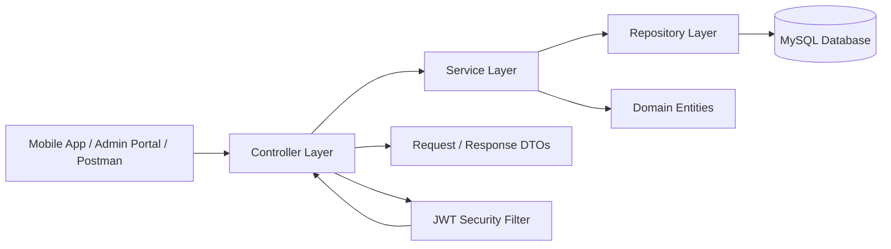

# Valor Lift Services & Maintenance Backend

## Overview
This Spring Boot 3 backend provides the REST API and persistence layer for the Valor Lift Services & Maintenance platform.
It covers:
- JWT-based authentication and authorization
- Customer, technician, and admin workflows
- Lift registration and lifecycle management
- AMC lifecycle management
- Service request handling and tracking
- Payments, invoices, support tickets, PDF service reports, and asset documents
- Admin transactions, reports/CSV exports, roles/permissions, and audit logs
- Swagger/OpenAPI documentation
- MySQL persistence with JPA

## Architecture
The backend follows a layered Spring Boot architecture:



### Layer responsibilities
- Controller layer handles HTTP endpoints and request validation.
- Service layer contains business logic and orchestration.
- Repository layer provides database access through Spring Data JPA.
- Entity classes map the business model to relational tables.
- DTOs keep API payloads separate from persistence models.
- Security components handle JWT authentication and protected routes.
- OpenAPI config exposes interactive API docs through Swagger UI.

## Requirements
- Java 21
- Maven 3.9+
- MySQL 8+

## Run locally
1. Ensure MySQL 8+ is running locally.
2. Copy `.env.example` to `.env` and fill only your local secret values:
   ```powershell
   Copy-Item .env.example .env
   ```
3. The default local database is `valor_world_dev`; the example URL includes
   `createDatabaseIfNotExist=true` so MySQL can create it when the configured
   user has permission.
4. Start the backend:
   ```powershell
   cd D:\RKKKK\Valor-Backend
   mvn spring-boot:run
   ```
5. Open Swagger UI:
   ```text
   http://localhost:8081/swagger-ui.html
   ```

Spring Boot imports the local `.env` file through `spring.config.import`. Keep
`.env` local and never commit it. The dev profile can bootstrap a local
SUPER_ADMIN account when `DEV_BOOTSTRAP_ENABLED=true` and both bootstrap
credentials are present in `.env`.

### Local dev seed data

The `dev` profile can also seed sample records for local UI development:

```dotenv
DEV_SEED_SAMPLE_DATA_ENABLED=true
DEV_SEED_SAMPLE_PASSWORD=<local sample password>
```

When enabled, startup keeps the bootstrap admin account and adds five sample
customers, five sample technicians, buildings, lifts, AMCs, and service
requests if they do not already exist. This is local-only development data; do
not use it for production or shared environments.

The dev seed also creates a fuller customer demo account for end-to-end
customer-app review:

- Customer: `mgopichakradhar@gmail.com`
- Password: the local value configured in `DEV_SEED_SAMPLE_PASSWORD`
- Seeded data: 4 buildings, 12 lifts, AMC contracts, invoices, payments,
  renewal requests, service requests across lifecycle statuses, visits,
  technician assignments, completed-service feedback, and notifications.

Useful local sign-ins after seeding:

- Admin: `admin@valor.local` with `DEV_BOOTSTRAP_SUPER_ADMIN_PASSWORD`.
- Sample customers: `ananya.rao@example.com`, `vikram.menon@example.com`,
  `priya.shah@example.com`, `farhan.khan@example.com`,
  `neha.iyer@example.com`, and `mgopichakradhar@gmail.com` with
  `DEV_SEED_SAMPLE_PASSWORD`.
- Sample technicians: `tech.arjun@valor.local`, `tech.meera@valor.local`,
  `tech.kabir@valor.local`, `tech.nisha@valor.local`,
  `tech.rohan@valor.local` with `DEV_SEED_SAMPLE_PASSWORD`.

The `tech.arjun@valor.local` technician seed includes a fuller Technician app
test set: mixed assigned/on-the-way/reached/in-progress/testing/completed/
cancelled jobs, emergency and non-emergency service types, visits,
attachments, latest location rows, invoices/payments, cash OTP rows, and
notifications. Use it for local Technician screen and flow verification only.

To wipe local data and reseed from scratch, stop the backend and drop only the
local development database configured by `DB_URL`, then run `mvn spring-boot:run`.
Flyway will recreate the schema before the dev seed runs.

### Disposable verification records

Cross-repository local verification may create disposable users and related
records with emails such as `verify.customer.*@valor.local` and
`verify.tech.*@valor.local`. Do not delete production-like or sample seed data
by broad table cleanup. If the local dev database must be pristine, prefer
dropping only the local development database configured by `DB_URL` and letting
Flyway/dev seed recreate it.

## Application Flow
### Typical request flow
1. The client sends an HTTP request to a controller endpoint.
2. The controller validates the request and maps it to a DTO or entity.
3. The service layer executes the business rule for that operation.
4. The repository layer reads from or writes to MySQL.
5. The service returns the result to the controller.
6. The controller wraps the result in a response object and sends it back to the client.

### Authentication flow
1. A user signs in with email and password.
2. The authentication service verifies credentials.
3. On success, the backend returns a JWT access token.
4. The client sends the token in the `Authorization` header for protected requests.
5. The JWT filter validates the token before the request reaches secured endpoints.

### AMC and service flow
1. An admin or operator creates or updates AMC records.
2. The AMC service updates contract details, renewal dates, and status.
3. Service requests are created for lift issues, inspections, or maintenance.
4. Technicians and admins update request status as work progresses.
5. The backend stores the latest state in MySQL and exposes it through the API.

## Main API groups

The canonical API contract lives in `BACKEND_API_CONTRACT.md`. All active
client-facing endpoints use the `/api/v1` prefix and the standard
`{ success, message, data, status, timestamp }` response envelope.

- Authentication: `/api/v1/auth/**`
- Current user: `/api/v1/me`
- Customer profile/assets: `/api/v1/customers/me/**`
- Service requests: `/api/v1/service-requests/**`
- Service visits: `/api/v1/admin/service-visits/**`, `/api/v1/customers/me/visits`, `/api/v1/technician/me/visits`
- Notifications: `/api/v1/notifications`
- Admin operations: `/api/v1/admin/**`
- Technician app: `/api/v1/technician/me/**`
- Payments and invoices: `/api/v1/payments`, `/api/v1/invoices`
- Admin transactions and reports: `/api/v1/admin/transactions`, `/api/v1/admin/reports/{type}`
- Admin roles and audit: `/api/v1/admin/permissions`, `/api/v1/admin/roles`,
  `/api/v1/admin/audit-logs`
- Razorpay checkout/webhook/refunds: `/api/v1/payments/razorpay/checkout`,
  `/api/v1/webhooks/razorpay`, `/api/v1/payments/{id}/refunds`
- Live technician tracking: `/api/v1/technician/me/jobs/{id}/location`,
  `/api/v1/customers/me/service-requests/{id}/technician-location`
- Technician arrival verification: `/api/v1/technician/me/jobs/{id}/arrival-otp/request`,
  `/api/v1/technician/me/jobs/{id}/arrival-otp/verify`,
  `/api/v1/service-requests/{id}/arrival-otp`
- Technician payment state: `/api/v1/technician/me/jobs/{id}/payment`,
  `/api/v1/payments/cash/otp/request`, `/api/v1/payments/cash/otp/verify`
- Support tickets: `/api/v1/support-tickets`
- AMC renewal requests: `/api/v1/amc-renewal-requests`
- AMC promo cards: customer read at `/api/v1/customers/me/amc-promotions`,
  admin edit at `/api/v1/admin/amc-promotions`
- Building/Lift documents: `/api/v1/buildings/{id}/documents`, `/api/v1/lifts/{id}/documents`,
  `/api/v1/customers/me/buildings/{id}/documents`, `/api/v1/customers/me/lifts/{id}/documents`

### Technician app backend quick reference

The dedicated Technician backend reference is `technician-backend.md`; the
canonical full contract is `BACKEND_API_CONTRACT.md`. The active Technician app
uses the following backend groups:

- Auth/session: `POST /api/v1/auth/login/technician`,
  `POST /api/v1/auth/refresh`, `POST /api/v1/auth/logout`, `GET /api/v1/me`.
- Profile/dashboard: `GET/PUT /api/v1/technician/me/profile`,
  `GET /api/v1/technician/me/dashboard`.
- Jobs/status: `GET /api/v1/technician/me/jobs`,
  `GET /api/v1/technician/me/jobs/{id}`,
  `POST /api/v1/service-requests/{id}/assignments/{assignmentId}/accept`,
  `POST /api/v1/service-requests/{id}/status`,
  `POST /api/v1/technician/me/jobs/{id}/report`.
- OTP gates: arrival OTP at
  `/api/v1/technician/me/jobs/{id}/arrival-otp/request`,
  `/api/v1/technician/me/jobs/{id}/arrival-otp/verify`, and
  `/api/v1/service-requests/{id}/arrival-otp`; completion OTP at
  `/api/v1/technician/me/jobs/{id}/completion-otp/request`,
  `/api/v1/technician/me/jobs/{id}/completion-otp/verify`, and
  `/api/v1/service-requests/{id}/completion-otp`.
- Checklist/evidence: `GET/PUT /api/v1/technician/me/jobs/{id}/checklist`,
  request attachments under `/api/v1/service-requests/{id}/attachments`, and
  private technician files under `/api/v1/technician/me/private-attachments`.
- Visits: `GET /api/v1/technician/me/visits`,
  `GET /api/v1/technician/me/visits/{id}`,
  `PUT /api/v1/technician/me/visits/{id}/status`,
  reschedule/additional/cancel visit request endpoints under the same visit.
- Maps/tracking: `POST /api/v1/technician/me/jobs/{id}/location`,
  `GET /api/v1/technician/me/jobs/{id}/location`, and customer readback at
  `GET /api/v1/customers/me/service-requests/{id}/technician-location`.
- Payment: `GET /api/v1/technician/me/jobs/{id}/payment` and cash OTP
  verification through `POST /api/v1/payments/cash/otp/verify`.
- Notifications/support: `GET /api/v1/notifications`,
  `PUT /api/v1/notifications/{id}/read`, and shared support tickets under
  `/api/v1/support-tickets`.

Technician clients receive only assignment-scoped customer/building/lift/job
data. The backend never returns customer credentials, password/token hashes, raw
OTP hashes, unrelated customer records, or fabricated route/ETA/map data.

### Local file storage

Service-request attachments are stored locally by default under
`./data/request-attachments`. Building/Lift documents are stored locally by
default under `./data/asset-documents`. These directories are local runtime
storage, not source-controlled assets. The API returns safe metadata and file
downloads; it never returns filesystem paths or storage keys.

### Payments and invoices

The backend keeps the internal payment and invoice domain as the business system
of record and extends it through a `PaymentGateway` abstraction with
`RazorpayGateway` as the current provider. Configure only environment-provided
test/live credentials when external activation begins:

```dotenv
RAZORPAY_KEY_ID=
RAZORPAY_KEY_SECRET=
RAZORPAY_WEBHOOK_SECRET=
```

Checkout creation is server-side and invoice-driven through
`POST /api/v1/payments/razorpay/checkout`; clients must not submit arbitrary
amounts. Razorpay webhook synchronization is exposed at
`POST /api/v1/webhooks/razorpay` and verifies `X-Razorpay-Signature` before
updating local payment/invoice/refund state. Refunds use
`POST /api/v1/payments/{id}/refunds`; a refund is not completed locally until
gateway/webhook state confirms it.

Provider activation remains environment-dependent. The local application can be
built and tested without purchased credentials, live Test Mode credentials, or a
public webhook endpoint; real Razorpay transactions and webhook delivery must be
validated later with provider configuration.

Webhook delivery from Razorpay requires a public HTTPS endpoint. Localhost-only
verification can test signature/idempotency behavior with simulated requests,
but it is not real Razorpay delivery.

### Admin transactions, reports, and exports

Admin/SUPER_ADMIN users can review finance movement through
`GET /api/v1/admin/transactions` and `GET /api/v1/admin/transactions/{id}`.
The transaction view is derived from existing payment and refund records; it is
not a duplicate payment system. Filters include pagination, sort, status,
customer profile, transaction type, date range, and safe search over invoice and
gateway reference identifiers.

Report endpoints are grouped under `/api/v1/admin/reports/{type}` for
`revenue`, `payments`, `invoices`, `services`, `customers`, and `technicians`.
The reports use persisted application data for payments, refunds, invoices,
service requests, visits, customers, AMC contracts, technicians and reports.
Revenue reports show gross successful payment amount, successful refunds and net
amount; no external Razorpay query or additional accounting ledger is used.

CSV export is available at `/api/v1/admin/transactions.csv` and
`/api/v1/admin/reports/{type}.csv`. Exports respect the same filters and Admin
authorization as the JSON endpoints, include safe CSV escaping, and do not
export secrets. Excel and PDF report exports are not implemented in Phase 13A.

### Admin roles, permissions, and audit log

Roles and permissions are persisted by Flyway V10 and extend the existing JWT
role model. `/api/v1/admin/permissions` and `/api/v1/admin/roles` expose the
seeded capability model. SUPER_ADMIN can update non-SUPER_ADMIN role
permissions through `/api/v1/admin/roles/{name}/permissions`; lower privileged
admins cannot grant permissions or edit themselves through this API.

The audit log is append-only through normal application mutations and can be
read through `/api/v1/admin/audit-logs` by accounts with audit-read permission.
It records actor, role, action, entity, timestamp, result, and compact safe
before/after summaries for key mutations such as staff changes, settings
updates, refund requests, role-permission changes, and finance/report exports.
Audit entries never store passwords, JWTs, refresh tokens, provider secrets,
OTP values, card data, CVV, or PIN values. No audit delete/update API exists.

Phase 1B local MySQL verification was completed on 2026-09-16 against the
existing database without reset or data deletion. Flyway showed V1-V9 successful,
including `payment_refunds`, `razorpay_webhook_events`, and
`technician_latest_locations` with the expected PK/FK/unique/check/index
metadata.

Phase 13B local MySQL verification was completed on 2026-09-17 against the same
database without reset or broad deletion. Flyway advanced the schema to V10 and
verified `roles`, `permissions`, `role_permissions`, and `audit_logs` with seeded
permissions, foreign keys, indexes, role mutation enforcement, and append-only
audit records.

Phase 1B.1 did not perform a real Razorpay Test Mode transaction or external
webhook delivery test because `RAZORPAY_KEY_ID`, `RAZORPAY_KEY_SECRET`,
`RAZORPAY_WEBHOOK_SECRET`, and a public HTTPS backend endpoint were not
configured in the local environment. Do not mark real gateway verification
complete from offline unit tests alone.

### PDF service reports

`GET /api/v1/service-requests/{id}/report.pdf` generates a PDF download from
the persisted structured service report for authorized customers, assigned or
historical technicians, and Admin/SUPER_ADMIN users. Generated PDFs are created
on request and are not committed or stored as source files.

## Code Structure
- `controller/` - HTTP API entry points
- `service/` - Business logic interfaces and implementations
- `repository/` - Spring Data JPA repositories
- `entity/` - Persistent domain models
- `dto/` - API request and response models
- `request/` - Request payload classes
- `response/` - Standard API response wrappers
- `security/` - JWT and security configuration
- `config/` - Application and OpenAPI configuration
- `exception/` - Custom exceptions and handlers

## Client integration contract

Use `http://localhost:8081` as the local API base URL. Production clients should
receive the deployed HTTPS URL through their environment configuration.

### Authentication

- Customer: `POST /api/v1/auth/register`, `POST /api/v1/auth/login/customer`,
  `POST /api/v1/auth/otp/send`, `POST /api/v1/auth/otp/verify`
- Admin: `POST /api/v1/auth/login/admin`
- Technician: `POST /api/v1/auth/login/technician`
- Refresh/logout: `POST /api/v1/auth/refresh`, `POST /api/v1/auth/logout`

Successful login returns an access token and role. Send the token on every
protected request:

```http
Authorization: Bearer <access-token>
```

All JSON responses use the common wrapper `{ success, message, data, timestamp,
status }`. The role values are `CUSTOMER`, `ADMIN`, `SUPER_ADMIN`, and
`TECHNICIAN`.

### Client responsibilities

- Admin web: dashboards, customers, technicians, buildings, lifts, AMCs,
  service assignment, payments, inventory, notifications, and reports.
- Customer app: account/profile, buildings and lifts, service-request creation
  and tracking, AMC/payment details, and notifications.
- Technician app: assigned jobs, customer/lift details, job start, job progress,
  completion, and notifications.

Swagger documentation is available at `/swagger-ui.html` after startup. Do not
point clients at the copied `Backend` folders inside another application; run and
deploy this project as the shared service.

## Phase 15 technician advanced operations

Phase 15 adds the application-level backend for technician checklists,
completion OTP gating, expanded technician profiles, and technician-private
attachments.

- Checklist templates and items are Admin/SUPER_ADMIN managed under
  `/api/v1/admin/checklist-templates`. Assigned technicians consume job
  checklists through `/api/v1/technician/me/jobs/{id}/checklist`.
- Required checklist items are validated by the backend before a service request
  can move to `COMPLETED`.
- Completion OTP values are generated by the backend, stored only as hashes,
  expire, enforce attempt limits, and are never returned in API responses or
  logs. The current sender is a no-op communication-provider implementation for
  application testing; real SMS/WhatsApp/email activation remains external work.
- Technician profiles now include profile photo URL, date of birth, gender,
  address, and emergency contact fields. Phone/email remain governed by the
  existing identity model and are not technician self-editable.
- Technician-private attachments are separate from request attachments and are
  visible only to the technician owner plus authorized Admin/SUPER_ADMIN users.
  Customers cannot access these files.

## Phase 16 advanced live tracking

The backend keeps the existing latest-location table/API and adds advanced
tracking around it:

- Each valid technician location update now writes a `technician_location_history`
  row for retention-ready history while keeping `technician_latest_locations`
  optimized for current map refreshes.
- Buildings support nullable latitude/longitude. Geofence state is evaluated only
  when real building coordinates exist; otherwise it remains unavailable.
- Geofence radius is configurable with `VALOR_TRACKING_GEOFENCE_RADIUS_METERS`.
- Route and ETA data are exposed through DTOs behind a `RoutingProvider`
  abstraction. The default provider is unconfigured and never fabricates route or
  ETA values.
- External routing credentials, provider activation, and real background/device
  validation remain later operational work.

## Technician lifecycle, arrival OTP, and cash payment

Technician status updates are shared with the customer after each successful transition. A technician may move an assigned job through `ASSIGNED`, `ACCEPTED`, `ON_THE_WAY`, `REACHED_SITE`, `DIAGNOSIS`, `REPAIR_IN_PROGRESS` or `WAITING_FOR_PARTS`, `TESTING`, and `COMPLETED`; `CANCELLED` is terminal.

After `REACHED_SITE`, the customer-facing arrival OTP becomes available. The technician must verify that OTP before moving the job into `DIAGNOSIS`. Completion still requires the structured report, required checklist responses, and completion OTP.

Quotes and invoices remain admin-owned. A customer can request cash payment only for an existing invoice; the five-minute cash OTP is then verified by the assigned technician or Admin. Successful verification marks the payment succeeded and the invoice paid. UPI/Razorpay remains gateway/webhook-authoritative and never uses the cash OTP flow.

The technician read endpoints return assignment-scoped route/location and invoice/payment state. They do not fabricate coordinates, ETAs, invoice totals, payment success, or OTP values.

## Technician registration temporary OTP and documents

Technician self-registration currently uses the temporary four-digit OTP `1111` because SMS provider keys are not configured. This is intentionally documented development behavior and must be replaced with the provider-backed delivery implementation before production use.

Aadhaar and driving licence are stored as optional identity-number fields on the application, not as uploaded files. Registration document uploads are optional for now; Admin review may verify any supplied files later, and submission does not block when the optional upload list is empty.

## Phase 17 communication platform foundation

Phase 17 centralizes provider-independent communication records without
activating any external messaging provider.

- Communication templates, preferences, events, and per-channel messages are
  stored in the Phase 17 communication tables.
- Supported channels are `EMAIL`, `SMS`, `WHATSAPP`, and `IN_APP`.
- Delivery status uses `PENDING`, `PROCESSING`, `SENT`, `DELIVERED`, `FAILED`,
  and `CANCELLED`, with retry count, max retry count, next retry time, provider
  metadata, and safe failure reason fields.
- `EmailProvider`, `SmsProvider`, and `WhatsAppProvider` abstractions isolate
  provider implementations. The current providers are mock/development
  providers only and do not call Email, MSG91, WhatsApp, or other external APIs.
- Idempotency is based on `communication_events.idempotency_key`; retrying the
  same event key reuses the existing event/messages instead of creating
  duplicates.
- Communication logs use masked recipients and sanitized failure reasons. OTP
  plaintext, provider keys, authorization tokens, passwords, and provider
  secrets must not be logged.
- Admin visibility is exposed under `/api/v1/admin/communications`.

Real Email/SMS/WhatsApp provider credentials and delivery activation remain
deferred to a later phase.
## Phase 18 Email System

Email delivery is implemented on top of the Phase 17 communication foundation. Business services enqueue communication events; `CommunicationService` creates idempotent `EMAIL` messages, renders templates, respects communication preferences for non-mandatory messages, and sends through the provider-neutral `EmailProvider` interface.

Provider activation is deliberately deferred. The current runtime uses `MockEmailProvider` for development and tests, so no real email is delivered and no real SMTP/API vendor is selected. Future adapters should implement `EmailProvider` without exposing provider SDK models to business services.

Generic configuration placeholders:

```env
EMAIL_PROVIDER=mock
EMAIL_HOST=
EMAIL_PORT=
EMAIL_USERNAME=
EMAIL_PASSWORD=
EMAIL_API_KEY=
EMAIL_FROM=
EMAIL_FROM_NAME=
EMAIL_REPLY_TO=
EMAIL_ENABLED=false
APP_SET_PASSWORD_URL=http://localhost:5173/set-password
```

Email templates support subject, HTML body, plain-text fallback, sender, reply-to, template variables, provider reference, retry count, and the existing communication statuses: `PENDING`, `PROCESSING`, `SENT`, `DELIVERED`, `FAILED`, and `CANCELLED`. Retry and idempotency reuse `communication_events.idempotency_key` and `communication_messages(event_id, channel)`.

Supported backend-triggered email events include customer onboarding/set-password, service request create/status/completion/feedback, technician account/assignment/job/visit/change-decision notifications, appointment scheduled/changed/cancelled, AMC renewal request, invoice created, payment result, and admin alert template support for existing admin/report/payment alert flows.

Security rules: never email raw passwords, OTPs, hashes, provider credentials, API keys, or tokens except the one-time set-password token embedded in the configured onboarding link. Onboarding tokens are hashed at rest, expire, and are single-use. Provider failure logging is sanitized and recipient logging remains masked.

## Phases 19-21 SMS, WhatsApp, And Preferences

SMS/OTP and WhatsApp continue to use provider abstractions. `OtpProvider` owns OTP send/resend delivery, with `MockOtpProvider` active for tests/dev and a dormant `Msg91OtpProvider` adapter shape for future activation. `SmsProvider` and `WhatsAppProvider` remain behind `CommunicationService`; `MockSmsProvider` and `MockWhatsAppProvider` are the only active providers.

OTP login endpoints:

```text
POST /api/v1/auth/otp/send
POST /api/v1/auth/otp/resend
POST /api/v1/auth/otp/verify
```

OTP values are generated server-side, hashed at rest, expire according to `MSG91_OTP_EXPIRY_SECONDS`, enforce resend cooldown, hourly rate limit, wrong-attempt lockout, and masked provider metadata. OTPs, MSG91 auth keys, tokens, and provider secrets must never be logged. Dev/test responses may include the OTP for automated tests; production send remains disabled until external provider activation.

Generic placeholders:

```env
MSG91_AUTH_KEY=
MSG91_TEMPLATE_ID=
MSG91_SENDER_ID=
MSG91_OTP_EXPIRY_SECONDS=300
WHATSAPP_PROVIDER=mock
WHATSAPP_ENABLED=false
WHATSAPP_API_KEY=
WHATSAPP_TEMPLATE_ID=
WHATSAPP_NAMESPACE=
WHATSAPP_SENDER=
```

Communication preferences now remain in `communication_preferences` and include channel plus category switches: email, SMS, WhatsApp, in-app, OTP SMS/WhatsApp, service, billing, appointment, job, visit, system, critical alert, and report notifications. Business events enqueue provider-neutral messages and preferences decide which non-mandatory channel/category messages are created.

Real MSG91 SMS/OTP and WhatsApp activation is not enabled in this phase.

## Phase 22 Communication Event Automation

Phase 22 wires real backend domain events into the existing communication stack instead of adding another notification system. Business services publish provider-neutral automation events; after the source transaction commits, `EmailEventService` opens a separate communication transaction, applies preferences and templates through `CommunicationService`, and persists delivery records in `communication_events` and `communication_messages`.

Automated events currently include customer onboarding, service-request creation, admin critical service alerts, technician assignment/reassignment, service-request status changes, visit scheduling/rescheduling/cancellation, AMC creation/renewal, invoice creation, payment result, service completion/feedback, and report-ready admin broadcasts where those backend flows already exist.

Automation uses the same idempotency keys, retry counters, failure reasons, provider references, and statuses from Phase 17-21. Non-mandatory messages respect channel/category preferences. Mandatory onboarding/security flows keep using the safe set-password/authentication rules and never email raw passwords. Email, SMS, MSG91 OTP, and WhatsApp providers remain mock or dormant unless explicitly activated in a later external-provider phase.
